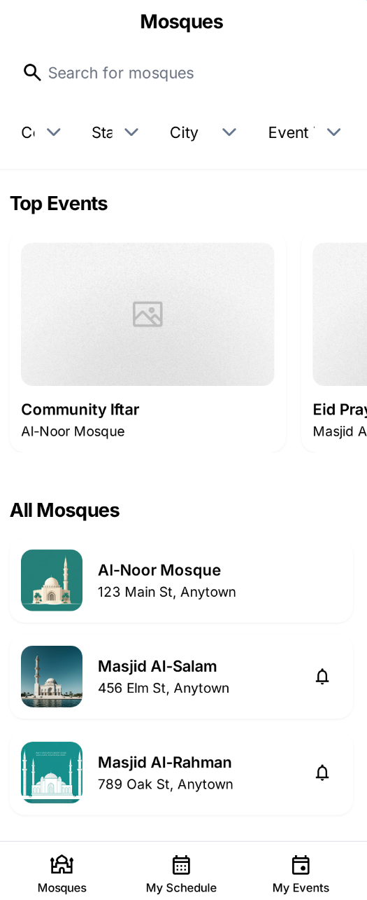
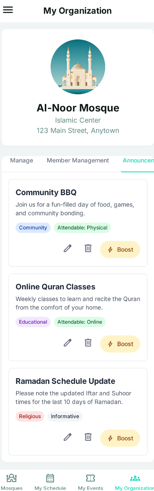
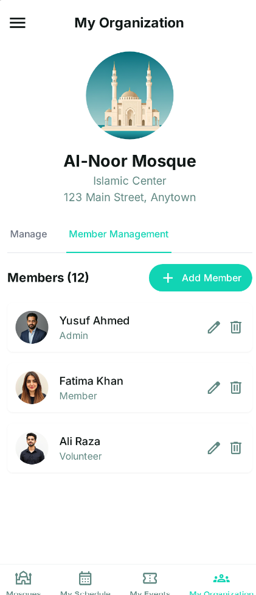
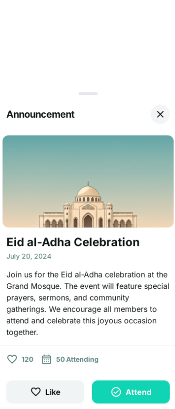
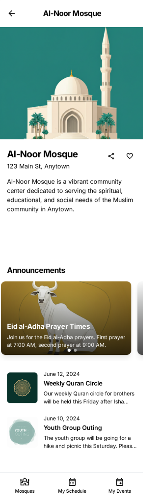
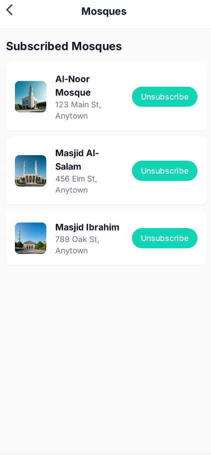

# Mosque App — Service Hub Platform

An integrated, production‑ready platform for modern mosque management. This repository brings together:

- A cross‑platform Mobile App (Flutter) for congregants and staff
- A Web‑based Admin Panel (React + Firebase) for operational control
- A Public, static Official Website for outreach and information

The goal is to streamline announcements, events, membership, reporting, and community engagement across devices and roles.

## Repository Structure

```
Mosque-app/
├── MosqueApp/service_hub_app/        # Flutter mobile application
├── mosque-admin-panel/               # React admin panel (Material UI + Firebase)
└── official-website/                 # Static landing website
```

## Key Features

- Announcements and notifications for congregants
- Event management: categories, scheduling, attendee tracking, reminders
- Mosque and organization registry with location metadata
- Member and user management with role‑based access
- Reports and analytics for activities and participation
- Cross‑platform support (Android, iOS, Web) for wider reach
- Secure data layer powered by Firebase (Auth, Firestore, Storage)

Planned roadmap highlights:
- Prayer time integration and Qibla direction
- Islamic calendar & Hijri date support
- Multi‑language experience (e.g., Arabic, English, Urdu)

## Tech Stack

- Mobile: Flutter (Dart ^3.6+), Firebase Core/Auth/Firestore/Storage/Messaging
- Admin Panel: React (CRA), Material UI, Firebase Web SDK
- Website: HTML/CSS static site, deployable on Vercel

## Quick Start

### 1) Mobile App (Flutter)

Prerequisites:
- Flutter SDK (stable) and Dart ^3.6+
- Android SDK (minSdk 23) and Xcode/iOS (minimum iOS 12.0)
- Firebase project with Android and iOS apps registered

Setup:
1. `cd MosqueApp/service_hub_app`
2. Install dependencies: `flutter pub get`
3. Configure Firebase:
   - Android: place `google-services.json` in `android/app/`
   - iOS: place `GoogleService-Info.plist` in `ios/Runner/`
   - Or use `lib/config/firebase_config.dart` to supply `FirebaseOptions` for each platform
4. Run the app:
   - Android/iOS: `flutter run`
   - Web (optional): `flutter run -d chrome`

### 2) Admin Panel (React)

Prerequisites:
- Node.js LTS and npm
- Firebase project (Web app credentials)

Setup:
1. `cd mosque-admin-panel`
2. Install dependencies: `npm install`
3. Configure Firebase credentials:
   - Update `src/firebase.js` with your Firebase Web config (`apiKey`, `authDomain`, `projectId`, etc.)
   - For production, prefer environment variables and avoid committing real secrets
4. Start development server: `npm start`
5. Build for production: `npm run build`

Deployment:
- Vercel configuration provided via `vercel.json` (output directory `build`)

### 3) Official Website (Static)

Prerequisites:
- Any static file server or Vercel CLI

Setup:
1. `cd official-website`
2. Local preview: open `index.html` in a browser or run `npx serve` and visit the served URL
3. Deployment: Vercel supported via `vercel.json`

## Security & Configuration

- Do not commit production credentials or API keys. Use environment variables or secure config management.
- Review Firebase rules (Firestore/Storage) to align with role‑based access and principle of least privilege.
- Rotate keys periodically and separate development/staging/production projects.

## Screenshots

Below are representative UI screens from the platform:










## Development Notes

- Linting: Flutter lints enabled via `analysis_options.yaml`. React uses CRA defaults.
- iOS minimum target: 12.0 (see `ios/Flutter/AppFrameworkInfo.plist`).
- Android minSdk: 23 (see `android/app/build.gradle`).
- CI/CD: Admin panel and website include Vercel configs; mobile CI is not configured in this repo.

## Contributing

Contributions are welcome. Please:
- Open an issue describing the improvement or bug.
- Follow the existing code style and structure.
- Keep pull requests focused and well‑documented.

## License

License to be determined. All rights reserved unless otherwise noted.

## Contact

For inquiries or support, please open an issue or reach out via the repository’s contact channels.